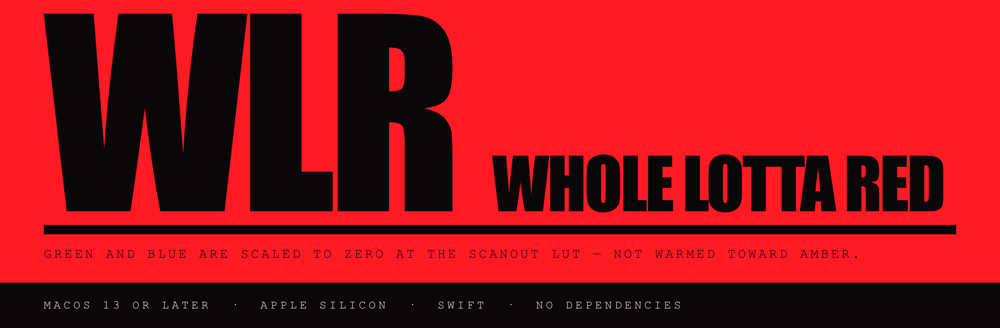
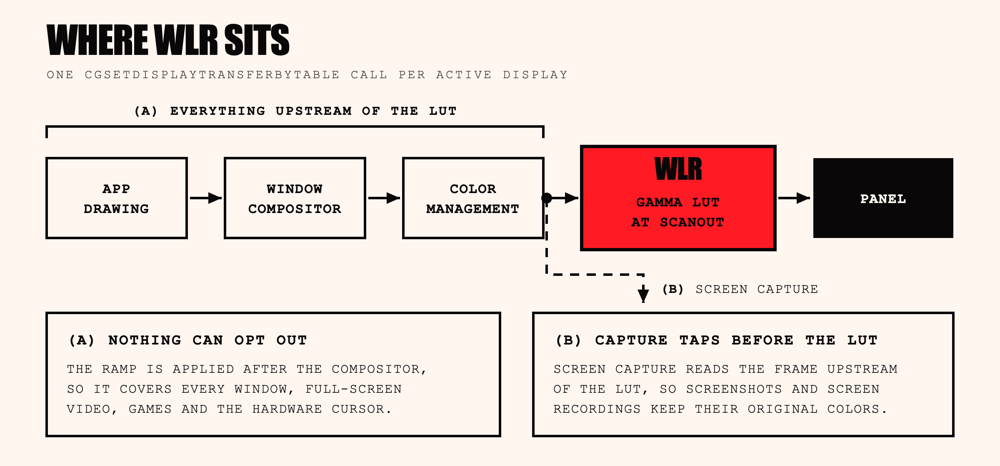
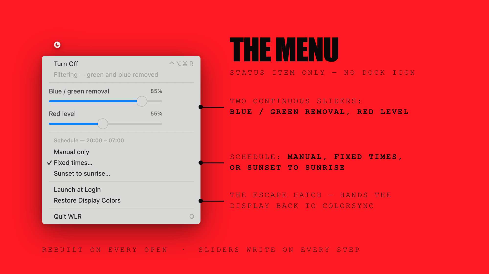

# WLR

A macOS menu-bar app that stops the display emitting green and blue light. Night Shift and
f.lux warm the picture — they cut blue output and pull the white point toward amber, and all
three channels keep emitting. WLR scales the green and blue scanout ramps to zero, so those
two channels emit nothing at any input level and only the red subpixels are lit. It costs you
information: see [The cutoff trade-off](#the-cutoff-trade-off).

macOS 13 or later · Apple silicon (Intel compiles, never run) · Swift, no dependencies · no
network access · no Location Services.

Built and verified on macOS 15.7.2 / M4. The deployment target and `LSMinimumSystemVersion`
are both 13.0 and the sources compile at that target; macOS 13 and 14 have not been run
against. The app asks for no permissions and triggers no TCC prompt — there is no
entitlements file, no sandbox, and no `NSUsageDescription` key in the bundle.

## How it works

WLR writes the per-channel gamma ramp on every active display with
`CGSetDisplayTransferByTable`. That table is the lookup the display pipeline applies at
scanout — after the window compositor, after color management, after everything an
application can influence.



What gets written is an identity ramp scaled per channel: red is multiplied by **Red level**,
green and blue by `1 − intensity`. It is not a change of gamma exponent; the panel's own
transfer function still applies afterwards. "Gamma ramp" is the API's name for the table, not
a description of the arithmetic. Each active display is written separately, with its ramp
sized to that display's own `CGDisplayGammaTableCapacity`; whether an external monitor honors
the table depends on the panel and the connection.

Four consequences of sitting at that level:

- **It covers everything.** Every window, full-screen video, games, and the hardware cursor.
  No application can opt out.
- **Screenshots and screen recordings are not affected.** They are captured before scanout, so
  a screenshot taken in red mode still contains the original colors. A screenshot attached to a bug report therefore shows the unfiltered colors.
- **Other software can overwrite the table.** Night Shift, display calibrators and some games
  write the same state. That is what the watchdog below is for. Running Night Shift at the same
  time means the two fight; turn Night Shift off.
- **macOS restores the table when this process dies.** Observed to hold under `SIGKILL` on macOS
  15.7. That is undocumented WindowServer behaviour, not something this app implements, so it
  could change; the app additionally installs handlers on ten signals plus an `atexit` hook,
  all calling `CGDisplayRestoreColorSyncSettings()`, which makes the restore immediate rather
  than dependent on process teardown.

The table is WindowServer state that no process owns, so any other program can overwrite it.
Three mechanisms re-assert it:

| Trigger | What happens |
|---|---|
| Drift | Every 2 seconds the app reads the table back and compares **only the top entry** of each of the three ramps against the expected value, tolerance 0.004. Any mismatch, or a failed read, re-writes every display. Runs only while the filter is applied. |
| Display reconfiguration | A `CGDisplayRegisterReconfigurationCallback` fires on hotplug and on resolution or arrangement changes, and the ramps are re-written with no animation. The "about to reconfigure" half of each callback pair is ignored, since a write made then is discarded by the reconfiguration itself. |
| Wake | Three `NSWorkspace` notifications — system wake, screens wake, and session became active — each schedule a re-apply **0.5 seconds later** rather than immediately. The re-apply exists because the table does not always survive a display power cycle; the half-second itself is an unexplained constant in the source. |

Because the drift check samples only the endpoint, a clobber that leaves the top of the ramp
intact while changing the middle of the curve — a re-applied calibration profile that moves
only midtones, say — is not detected.

Changes fade rather than cutting. The fade is a 60 Hz timer running a smoothstep over
`transitionSeconds` (default 2), and every frame is a full table write to every display, which
is the cost of a long transition.

## Getting out

In rough order of how much has gone wrong:

| route | what it does |
|---|---|
| `⌃⌥⌘R` | Global toggle. Works while any app is focused. |
| Menu bar → Restore Display Colors | Drops the filter and hands the display back to ColorSync. |
| `killall WLR` | macOS restores the display as the process exits. |
| `/Applications/WLR.app/Contents/MacOS/wlr-restore` | Resets the ramps directly. Needs nothing from the app. |

`wlr-restore` is a backstop for cases process death does not cover — the app wedged but alive,
or some other program having left the ramps somewhere strange. Worth aliasing, since you may
end up typing it on a screen you can barely read.

Three things about those four rows:

- **While WLR is running and filtering, the watchdog undoes an external restore within two
  seconds.** That includes `wlr-restore` and `make restore`. Stop the filter first with one of
  the top three rows, or quit the app.
- **The hot key can fail to register silently.** It is registered through Carbon's
  `RegisterEventHotKey`, which is what lets it work with no Accessibility permission, but the
  registration result is discarded. If another app already owns `⌃⌥⌘R`, the key does nothing
  and nothing says so. Clicking Turn On / Off in the menu does the same thing.
- **"Restore Display Colors" is a hard off, not a peek.** It sets `enabled` to false, and
  because the scheduler is edge-triggered it stays off until the next real schedule boundary
  rather than coming back at the next 30-second tick.

Calling CoreGraphics from a signal handler is not async-signal-safe. The handlers do it anyway:
the failure they guard against is a screen too red to read.

## The cutoff trade-off

Zeroing green and blue is what a per-channel gamma ramp can do. It also
destroys information: a per-channel lookup table cannot mix channels, so it cannot map color
to red-tinted *luminance*. Pure blue content has no red component, so it goes black rather than
dark red. Blue text on a black background becomes invisible.

In practice most of the macOS UI stays readable, because most of it is not fully saturated.
What suffers is syntax highlighting, links, and anything that encodes meaning in hue alone. Two
ways to soften it:

- Pull **Blue / green removal** below 100%. At 85% or so, blue content is heavily suppressed
  but still legible.
- Try macOS's own filter alongside this one: System Settings → Accessibility → Display →
  Color Filters → Color Tint. That one runs in the compositor and does map luminance to a
  tint, so it preserves detail. **The combination is untested.**

Luminance mapping through a full-screen overlay window does not work on macOS 15.7.2.
`CALayer.compositingFilter` is ignored, so the window paints as opaque red above the menu bar and
the screen becomes unusable. That approach has been removed; do not rebuild it that way. Doing it properly would require
capturing the screen with ScreenCaptureKit, transforming each frame on the GPU and presenting
it — continuous capture, Screen Recording permission, and added latency, for a cosmetic gain.

## Controls



The app is `LSUIElement`: a moon icon in the menu bar, filled when the filter is on, and no
Dock tile or app menu. The menu is rebuilt from current state every time it opens.

- **Turn On / Off** — also `⌃⌥⌘R`. The disabled line under it reads "Filtering — green and blue
  removed" or "Not filtering".
- **Blue / green removal** — 0–100%. 100% zeroes both channels. The slider is continuous:
  dragging keeps the menu open and applies on every step.
- **Red level** — 15–100%. Scales red down; red-only at full output is brighter than most
  people want at night, and it goes below the panel's own minimum brightness. Floored at 15% so
  the screen can never get too dark to find the menu bar and switch it off. The floor is
  enforced on read as well as write, so a lower value written externally has no effect, though
  `defaults read` still shows what you wrote.
- **Schedule** — a header line showing the current mode or times, then Manual only, Fixed
  times…, Sunset to sunrise….
- **Launch at Login** — writes `~/Library/LaunchAgents/com.btc.wlr.plist` and loads it with
  `launchctl bootstrap gui/$(id -u)`. The plist has no `KeepAlive`, so Quit actually quits.
- **Restore Display Colors** — see "Getting out"; this is a hard off.
- **Quit WLR**.

Two things the login item does that are easy to trip over:

- It records the path of the executable running when you ticked the box, so tick it from the
  copy in `/Applications`. Tick it from a build directory, then move or delete that bundle, and
  the login item points at a dead path.
- `RunAtLoad` starts a second copy immediately. A second copy detects the first and quits
  silently — the same thing you see if you double-click WLR while it is already running.

## Scheduling

Three modes, chosen from the menu and stored in the `schedule` key:

- `manual` — the scheduler never touches the filter.
- `fixed` — on and off at times of day, stored as minutes past local midnight (defaults 20:00
  and 07:00). A window that wraps midnight is handled explicitly; `on == off` means always off.
- `solar` — on from sunset to sunrise.

The scheduler re-evaluates **every 30 seconds** and is edge-triggered: it acts only when the
answer to "should it be night right now?" changes. Toggling by hand mid-evening therefore
sticks until the next real boundary instead of being reverted on the next tick. It also
evaluates once at launch, unconditionally, which means a persisted `fixed` or `solar` mode can
turn the filter on at login with no click.

Sun times are computed from coordinates you type in, using the low-precision solar position
model (mean anomaly → equation of centre → ecliptic longitude → declination → hour angle),
accurate to about a minute at temperate latitudes. There is no network call and Location
Services is never requested. The default coordinates are 40.7128 / -74.0060, New York City.
Above the Arctic and below the Antarctic circle, where there is no sunrise or sunset to
bracket, it falls back to a declination-versus-hemisphere test. There is no test in the repo
covering the sun math; `make selftest` exercises the gamma path only.

Coordinates typed into the dialog are range-checked to ±90 and ±180. Coordinates written with
`defaults` are not.

One known rough edge: when a schedule decides "on" at launch, the filter fades in over
`transitionSeconds` instead of appearing already applied. The launch path paints without
animating, but it does not cancel the animation that the scheduler's own state change started
a moment earlier, so the next frame of that animation overrides it.

## Scripting

Settings live in `UserDefaults` under the domain `com.btc.wlr`, so anything that can run
`defaults` can drive the app. `UserDefaults.didChangeNotification` does not fire for writes
made by another process, so the app instead polls those nine keys **once a second** and posts a
change when the snapshot differs. Budget up to about a second of latency for a scripted write,
plus the fade.

```sh
defaults write com.btc.wlr enabled -bool true
defaults write com.btc.wlr intensity -float 0.85   # 85% of G/B removed
defaults write com.btc.wlr redLevel  -float 0.4    # dim the red
defaults write com.btc.wlr transitionSeconds -float 30
```

| key | type | default | meaning |
|---|---|---|---|
| `enabled` | bool | `false` | filter on |
| `intensity` | float 0–1 | `1.0` | fraction of green and blue removed; 1 zeroes both channels |
| `redLevel` | float 0.15–1 | `1.0` | red channel scale; anything below 0.15 is treated as 0.15 |
| `schedule` | `manual` \| `fixed` \| `solar` | `manual` | schedule mode |
| `onMinutes` | int | `1200` (20:00) | minutes past local midnight, `fixed` mode |
| `offMinutes` | int | `420` (07:00) | minutes past local midnight, `fixed` mode |
| `latitude` | float | `40.7128` | `solar` mode |
| `longitude` | float | `-74.0060` | `solar` mode |
| `transitionSeconds` | float | `2.0` | fade duration; 0.01 or below is an instant cut |

## Build

Command Line Tools are enough; no Xcode project, no package manager, no third-party code. The
Makefile invokes `swiftc` once per binary — two for the app bundle, a third for the self-test tool —
and assembles the bundle by hand.

```sh
make            # build WLR.app
make install    # copy to /Applications
make run        # build, then relaunch
make restore    # reset the display ramps
make selftest   # drive the running app and read the LUT back
make clean      # remove .build and WLR.app
```

`make selftest` drives the running app through the `defaults` interface and reads the gamma
table back from the WindowServer, checking off, full cutoff, red scaling, partial intensity,
restore, and `SIGKILL` recovery. Four things to know before running it:

- **It turns the screen red for a few seconds.**
- It overwrites `intensity`, `redLevel` and `transitionSeconds` rather than saving and
  restoring them, and finishes with `transitionSeconds` at 2.0 and `enabled` false.
- It `SIGKILL`s whatever copy of WLR it finds, then opens `/Applications/WLR.app` specifically.
  If the copy under test came from `make run`, you end up with the installed copy running
  instead of your build — or nothing running, if you have never run `make install`.
- It exits with a message and does nothing if no copy of WLR is running.

The build target is `$(uname -m)-apple-macos13.0`, so the same Makefile produces an x86_64
build on an Intel Mac. Nothing in the sources is Apple-Silicon-specific and the x86_64 target
compiles, but that build has never been run. Either way the output is single-arch, not
universal.

The bundle is ad-hoc signed (`codesign --force --sign -`). It is not notarised, so Gatekeeper blocks it on
any machine other than the one that built it.

To remove it completely:

```sh
launchctl bootout gui/$(id -u)/com.btc.wlr     # only if Launch at Login was on
rm -f ~/Library/LaunchAgents/com.btc.wlr.plist
rm -rf /Applications/WLR.app
defaults delete com.btc.wlr
```

## Repository layout

| path | what it is |
|---|---|
| `Sources/main.swift` | process entry point; installs the signal and `atexit` restore net before any AppKit object exists |
| `Sources/AppDelegate.swift` | launch wiring, status item, menu construction, the two settings dialogs |
| `Sources/FilterController.swift` | the on/off state and the animated fade; the only thing that drives the gamma engine |
| `Sources/GammaEngine.swift` | the display table writes, the drift watchdog, display reconfiguration |
| `Sources/Preferences.swift` | `UserDefaults` settings with clamping, plus the 1 Hz poll for external writes |
| `Sources/Scheduler.swift` | edge-triggered fixed-time and sunset-to-sunrise scheduling |
| `Sources/Solar.swift` | offline sunrise/sunset arithmetic; pure functions |
| `Sources/HotKey.swift` | the `⌃⌥⌘R` global hot key, via Carbon |
| `Sources/LoginItem.swift` | launch-at-login as a per-user LaunchAgent |
| `Sources/MenuSupport.swift` | closure-backed menu item, in-menu slider |
| `Tools/restore.swift` | builds `wlr-restore`, shipped inside the bundle |
| `Tools/selftest.swift` | builds `wlr-selftest`, run by `make selftest`; not shipped |
| `Resources/Info.plist` | bundle metadata: `LSUIElement`, `LSMinimumSystemVersion` 13.0, and sudden and automatic termination both disabled — `NSSupportsSuddenTermination` false is what guarantees `applicationWillTerminate` runs and hands the table back on a normal quit |
| `Makefile` | three `swiftc` rules (two run for the default build), hand-assembled bundle, ad-hoc codesign |
| `site/index.html` | standalone landing page |
| `docs/` | the three images embedded above |
| `LICENSE` | all rights reserved |
| `.gitignore` | excludes `.build/` and `WLR.app/` |

`site/index.html` is standalone: no build step, no external resources. Open it directly in a
browser. Its two sliders drive an SVG `feColorMatrix` that applies the same per-channel scaling
the app applies in hardware, so the page previews the filter on its own content. The control rail sits outside the filtered
element and stays unfiltered.

## License

All rights reserved. See `LICENSE`.
